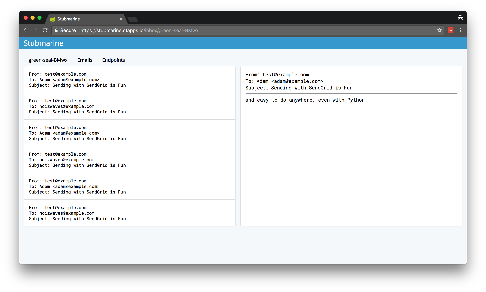

<header class="header">
  <section class="container">
    <h1 class="title">Stubmarine</h1>
    
    

      Pre-built external service stubs to improve developer experience.
       
      <i>
        <small>Currently {{ site.stubmarine.currentversion }} ({{ site.stubmarine.currentsize }})</small>
      </i>
    

    

      <a class="button button-outline" href="{{ site.stubmarine.demourl }}" target="_blank">Try Demo</a>
      <a class="button" href="#getting-started">Getting Started</a>
    

  </section>
</header>

<section class="container" id="getting-started">
  <h3 class="title">Getting Started</h3>
  
Get started using Stubmarine quickly by doing:

  <ol class="steps">
    <li>Install a Java 8 compatable JRE</li>
    <li>
      <code class="highlighter-rouge">curl -OL {{ site.stubmarine.currentrelease }}</code>
    </li>
    <li>Run <code class="highlighter-rouge">JWTSECRET=secret java -jar {{ site.stubmarine.currentjar }}</code></li>
  </ol>
</section>

<section class="container">
  <h3 class="title">Why?</h3>
  

    

      <h4>Prevent data accidents</h4>
      
Stubmarine works with any email addresses - never accidentally send emails to real inboxes again

    

    

      <h4>Develop in isolation</h4>
      
Insulate yourself against 3rd party outages and spec changes that halt development

    

    

      <h4>Develop offline</h4>
      
Don't rely on internet connectivity to develop code by running Stubmarine locally

    

  

</section>

<section class="container">
  <h3 class="title">Using Stubmarine</h3>
  
Using Stubmarine is easy.

  <ol class="steps">
    <li>Take your existing 12-factor app</li>
    <li>Reconfigure external dependencies to point to Stubmarine</li>
    <li>Develop code with ease!</li>
  </ol>
</section>

<section class="container">
  <h3 class="title">Happy Users</h3>
  TODO
</section>
